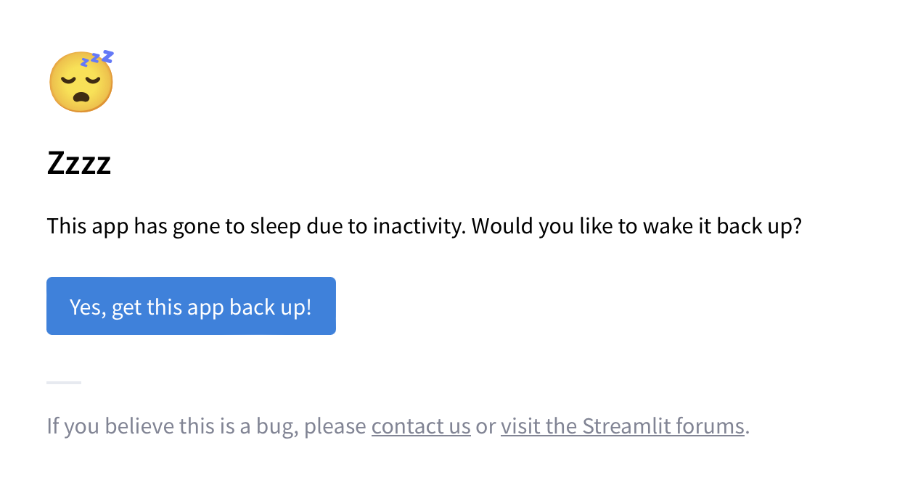
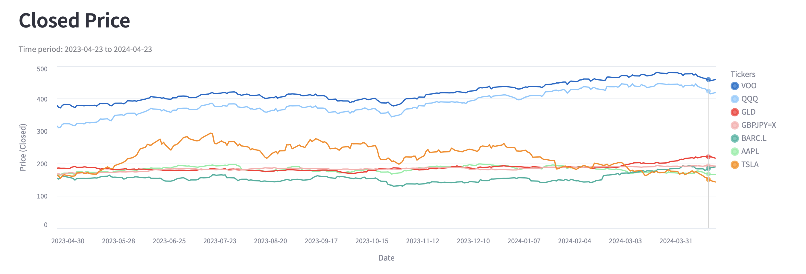

# Stock Correlation Matrix
This project is a variation of my CS50P Final Project. 

Visit this for the web app hosting on Streamlit: 
https://stock-correlation-matrix.streamlit.app

If you see the below message while visiting the link, feel free to click the blue button and it should bring the app back: 

On the web app, input the tickers and date range: 

The web app will update the below plots using the new tickers and date range: 

The pricing data and the correlation matrix are downloadable in excel format: 

# Below is the readme file for the original project. 

## Description:
### Summary:
This project uses the `yfinance` package to retrieve stock pricing data and calculate the correlation of the price changes between the selected stocks using their daily closed price. A Streamlit web app is used to show a line chart of the price change and a correlation matrix. The user also has the option to download the price and correlation data as an xlsx file.

### Packages used:
- datetime
- pandas
- streamlit
- altair
- streamlit_tags
- openpyxl
- yfinance
- matplotlib

### Files
#### project.py
This file contains all the Streamlit codes and calls the individual functions which perform the data gathering, cleaning and visualisation.

#### test_project.py
This is a `pytest` file in which there are multiple testing functions to check if the custom functions in `project.py` are returning expected results, and if errors are being flagged when unexpected values are returned.

#### requirements.txt
This contains all the external packages used for the `project.py` and `test_project.py` scripts.

### Data gathering
Data input fields are created using the `st_tags` and `st.date_input` functions, which allow users to easily input the stocks and select the date period they want for the calculation.

The stock input field has several tickers pre-filled as examples for the user. This field is limited to 20 tickers to avoid abusive usage of the API.

The date input fields also have preset filled. The start date would be one year ago from today, and the end date would be today.

The selected stock and date data will be fed into the `ticker_closed_price` function. It will evaluate if the user inputs 2 or more tickers, and if the date period is valid (start date >= end date). If the user fails one of these requirements, an error message will be prompted and ask the user to change their input value.

When both requirements are passed, the function will then call the Yahoo finance API and extract the pricing data for the selected tickers within the selected date period.

The function will also evaluate if any one of the tickers returned `null` on all dates. When that occurs, it will raise a `ValueError` and tell the user that the API cannot find any price data for a specific ticker, and ask the user to amend the input.

### Data Cleaning & Transformation
The data received from the Yahoo Finance API contains multiple dataframes grouped by individual tickers. The `ticker_closed_price` function would perform some basic data cleaning to merge them under one data frame in wide format. This will then be returned to the main script. In the main script, a separate line is used to transform the dataframe into long format. Both wide and long formats of the data are preserved in the main script for two different visualisations.

### Data Visualisation - Closed Price Line Chart
The `line_chart` function utilises the `altair` package to visualise the daily closed price for each ticker in an interactive line chart. The long format dataframe was used for the visualisation.

The line chart performs as a visual indicator for the user to easily skim the price change history of the selected tickers. The line chart also indicates when is the starting date and end date for each ticker within the selected date period, as stocks can be listed or delisted within the period. This is an important indicator for the correlation matrix in the next step, as it will only calculate the correlation using dates where prices for all selected tickers are available.

The line chart is also interactive. The user can hover over each line and it will show the closed price of the stock at the closest date. The legend on the right side of the chart is sorted according to the latest price of the tickers, therefore it is aligned with the order of the lines at their endpoint.

### Data Visualisation - Correlation Matrix
The correlation matrix is first done by transforming the wide format dataframe to a correlation matrix with `corr` function from the `pandas` library. There is a lower threshold set for the number of valid rows. If there are less than 3 rows of data with all selected tickers having non-na value, a `ValueError` would be raised and prompt the user to adjust the stock and date input.

After the correlation matrix is calculated, it is coloured using `df.style`. The correlation matrix is then returned as a static table in Streamlit for visualisation.

### Data Extract
The wide format pricing dataframe and the correlation matrix are downloadable on the Streamlit web app.

An Excel file with two separate sheets containing the two datasets is created using the `openpyxl` library and the `ExcelWriter` function from `pandas`.

We used Excel file as the data extraction format to streamline the downloading process so that users can download both datasets in a one-click action.

### Code Testing
Multiple test functions are set under the `test_project.py` file to test the below functions from the `project.py` script.

#### ticker_closed_price
A test function was used to check if the function returns a `pandas` dataframe when there are two or more tickers input, and the start date is smaller than the end date. Two other test functions were used to validate if the function returned `ValueError` when there are less than two tickers, and when the start date is larger than the end date in the user input.

#### corr_matrix
Test functions were used to check if the correlation matrix returned the correct calculation in several different scenarios. They were also used to test if the function would return `ValueError` with invalid data.

#### heatmap
Test functions were used to check if the function successfully returned a `pd.io.formats.style.Styler` instance, which indicates the dataframe is being styled as designed.